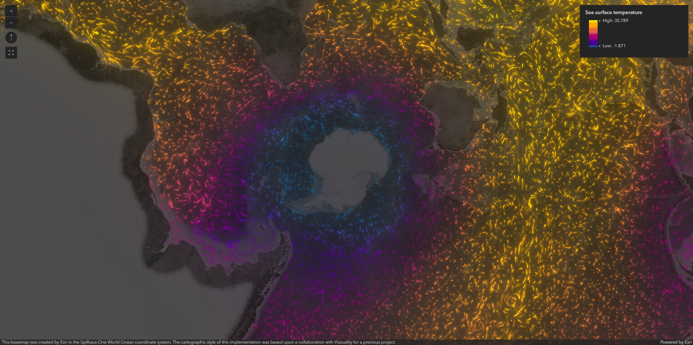

# ArcGIS FlowRenderer with Effects and Blending

A web application demonstrating the FlowRenderer with effects and blending using ArcGIS Maps SDK for JavaScript. This component visualizes flow patterns with advanced rendering effects and blending modes.

## Features

- **Flow Visualization**: Dynamic rendering of flow patterns and movements
- **Visual Effects**: Advanced effects for enhanced flow visualization
- **Blending Modes**: Multiple blending options for flow layers
- **Custom Styling**: Configurable colors and patterns
- **Performance Optimized**: Efficient rendering of complex flow patterns
- **Dark Theme Integration**: Optimized for dark theme UI

## Screenshots



*Flow visualization with advanced effects and blending*

## Prerequisites

- NodeJS
- Vite

## Detailed Implementation Guide

### Project Setup

1. **Initialize Project**

   ```bash
   # Create a new Vite project
   npm create vite@latest
   ```

   Follow the instructions on screen to initialize the project.

2. **Install Dependencies**
   ```bash
   npm install
   ```

## Code Structure

### HTML Structure

The HTML file sets up the basic structure for the ArcGIS web application:

```html
<!DOCTYPE html>
<html lang="en">
  <head>
    <meta charset="utf-8" />
    <meta
      name="viewport"
      content="initial-scale=1,maximum-scale=1,user-scalable=no"
    />
    <title>
      FlowRenderer with effects and blending | Sample | ArcGIS Maps SDK for
      JavaScript 4.32
    </title>

    <link
      rel="stylesheet"
      href="https://js.arcgis.com/4.32/esri/themes/dark/main.css"
    />
    <script src="https://js.arcgis.com/4.32/"></script>

    <link rel="stylesheet" href="./src/style.css" />
  </head>
  <body>
    <div id="viewDiv"></div>
    <script type="module" src="./src/main.js"></script>
  </body>
</html>
```

### CSS Styling (src/style.css)

The CSS file provides styling for the map view and UI elements:

```css
#viewDiv {
  padding: 0;
  margin: 0;
  height: 100vh;
  width: 100%;
}
```

### JavaScript Implementation (src/main.js)

The JavaScript file implements the ArcGIS web application:

1. Initialize Spilhaus basemap with effects

```javascript
const spilhausBasemap = new TileLayer({
  url: "https://tiles.arcgis.com/tiles/nGt4QxSblgDfeJn9/arcgis/rest/services/Spilhaus_Vibrant_Basemap/MapServer",
  effect: "saturate(10%) brightness(0.3)", // dim brightness to create darker style basemap
});
```

2. Create map with basemap

```javascript
const map = new Map({
  basemap: spilhausBasemap,
});
```

3. Initialize the view

```javascript
const view = new MapView({
  container: "viewDiv",
  map: map,
  zoom: 2,
  center: [0, 0],
});
```

4. Add widgets

```javascript
view.ui.add(
  new Legend({
    view: view,
  }),
  "bottom-right"
);

view.ui.add(
  new Fullscreen({
    view: view,
  }),
  "top-left"
);
```

5. Wrap the above code with the required require statement.

```javascript
require([
  "esri/Map",
  "esri/views/MapView",
  "esri/layers/ImageryTileLayer",
  "esri/layers/TileLayer",
  "esri/layers/GroupLayer",
  "esri/rest/support/MultipartColorRamp",
  "esri/rest/support/AlgorithmicColorRamp",
  "esri/Color",
  "esri/widgets/Legend",
  "esri/widgets/Fullscreen",
], function (
  Map,
  MapView,
  ImageryTileLayer,
  TileLayer,
  GroupLayer,
  MultipartColorRamp,
  AlgorithmicColorRamp,
  Color,
  Legend,
  Fullscreen
) {});
```

## Running the Application

1. **Development Server**

   ```bash
   npm run dev
   ```

   This will start the development server at `http://localhost:5173`

2. **Build for Production**
   ```bash
   npm run build
   ```

   This will create a production-ready build in the `dist` directory

3. **Preview Production Build**
   ```bash
   npm run preview
   ```

## Usage

1. **View the Flow Visualization**
   - Open the application to see the flow visualization initialized
   - The dark theme provides optimal contrast for flow patterns
   - Flow patterns are automatically animated

2. **Explore Flow Patterns**
   - Use standard map navigation controls to explore different areas
   - Zoom in to see detailed flow patterns
   - Pan to view different regions

3. **Adjust Flow Effects**
   - The visualization uses multiple blending modes for depth
   - Flow patterns have configurable colors and patterns
   - Effects are optimized for performance

4. **Use Navigation Controls**
   - Standard zoom controls for adjusting view scale
   - Pan controls for moving around the map
   - Rotation controls for viewing flow patterns from different angles
